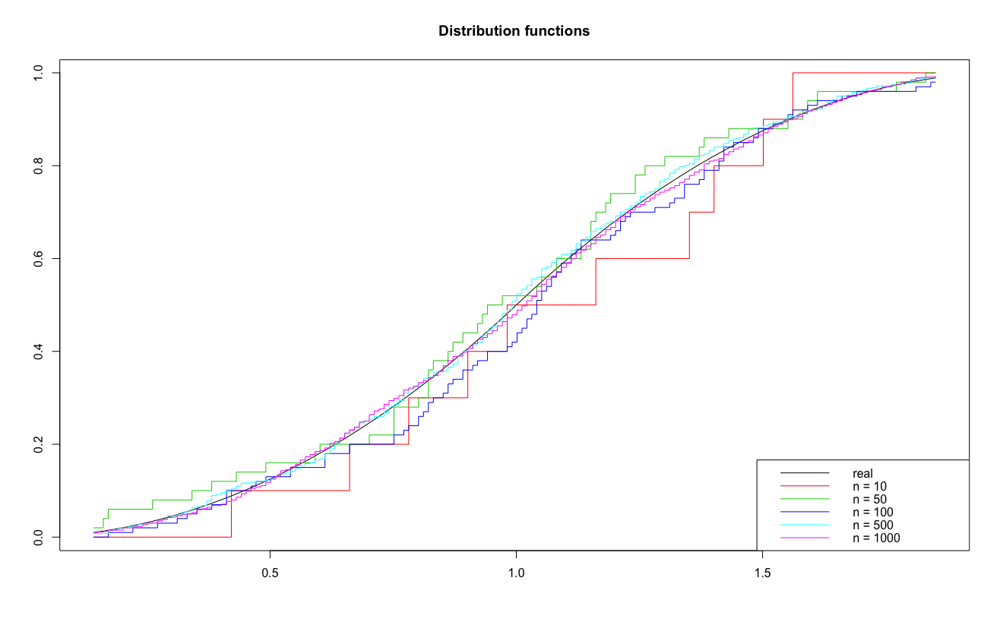
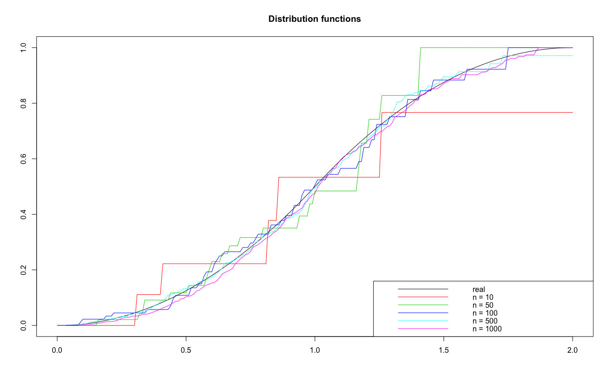

# Nonparametric statistics


---
## Table of Contents
- [Description](#description)
- [How to use](#how-to-use)
- [Theoretical basis](#theoretical-basis)
- [Author Info](#author-info)
---

## Description

Here you can find application and discription of widespread nonparametric statistics' methods. They used to estimate distibution function and density in a simple case and cases of censored and biased samples, classify data, estimate nonparametric regression function.

## How to use

Download and install packages

 - [triangle](https://cran.r-project.org/web/packages/triangle/index.html)

 ```install.packages("~/Downloads/triangle_0.12.tar", repos = NULL, type="source")```

## Theoretical basis

1. ### Estimation of distribution function (usual sample)

Let sample X = (X1, …, Xn) be independent, identically distributed real random variables with the common cumulative distribution function F(t). For estimation F of the sample can be used the Empirical Distribution function defined as

<p align="center">
 
</p>

Then
 is an unbiased estimator of F(x) with variance
<p align="center">
 
</p>

More ditails on wiki [Empirical distribution function](https://en.wikipedia.org/wiki/Empirical_distribution_function)

- #### `empirical_distribution.R` content:

I build Empirical distibution estimators for samples  of length n = 10, 50, 100, 500, 1000 and Confidence intervals for those samples with m = 1000 - number of repetitions, check the quality of those statistics. 

Here's the resultiong plot 



2. ### Estimation of distribution function (censored sample)

Let X = (X1, …, Xn) be a censored sample in term of Xj = min(Zj, Yj) - censoring, delta_j = 1{Zj < Yj} - absence of censoring indicator, where Zj - observed variable with distribution F, Yj - censor, j = 1..n.
If the censor's distibution is unknown, Kaplan-Meier estimator (product limit estimator) helps to pridict distibution F of real not censored variables Zj.

Formula: for pairs (Xj, delta_j): X[i] -  arranged in ascending order, delta_[i] - corresponding to X[i], then Kaplan-Meier estimator can be written:
<p align = "center">
 
</p>

Kaplan-Meier estimator is asymptotically normal with asymptotical variance:

<p align = "center">
 
</p>

- #### `censored_sample.R` content:
Analogically to `empirical_distribution.R` I build Kaplan-Meier estimators for samples  of length n = 10, 50, 100, 500, 1000 and Confidence intervals for those samples with m = 1000 - number of repetitions, check the quality of those statistics. 

Here's the resultiong plot 



## Author Info
Made by Havriushenko Anastasiia
- mail - havriushenko.nasty@gmail.com
- facebook - https://www.facebook.com/gastad601

Tasks provided by [Maiboroda, R.E.](http://probability.univ.kiev.ua/index.php?page=userinfo&person=mre&lan=ru)
- mail - mre@univ.kiev.ua


[Back to the top](#nonparametric-statistics)
